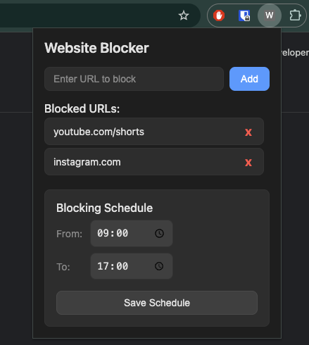

# Website Blocker Chrome Extension

A Chrome extension that helps you stay focused by blocking distracting websites. This extension allows you to manage and block access to websites that might distract you from your work or studies.

The extension provides a simple interface where you can:

- Add URLs to block
- View and manage your blocked URLs list
- Set a blocking schedule (e.g., 09:00 to 17:00)

## Features

- Block access to distracting websites
- Set specific time periods for blocking (e.g., during work hours)
- Easy-to-use popup interface
- Persistent blocking across browser sessions
- Customizable block list
- Simple and intuitive user interface

## Installation

1. Clone this repository or download the source code
2. Open Chrome and navigate to `chrome://extensions/`
3. Enable "Developer mode" in the top right corner
4. Click "Load unpacked" and select the extension directory

## Usage

1. Click the extension icon in your Chrome toolbar to open the popup interface
2. Add websites to your block list (e.g., youtube.com/shorts, instagram.com)
3. Set your preferred blocking schedule
4. The extension will automatically block access to listed websites during the specified time
5. Manage your block list and schedule through the popup interface

## Project Structure

- `manifest.json` - Extension configuration file
- `popup.html` - The extension's popup interface
- `popup.js` - Popup interface functionality
- `background.js` - Background service worker for website blocking
- `blocked.html` - Page shown when a blocked website is accessed

## Development

This extension is built using:

- Chrome Extension Manifest V3
- JavaScript
- HTML/CSS

## Contributing

Feel free to submit issues and enhancement requests!

## License

This project is open source and available under the MIT License.
